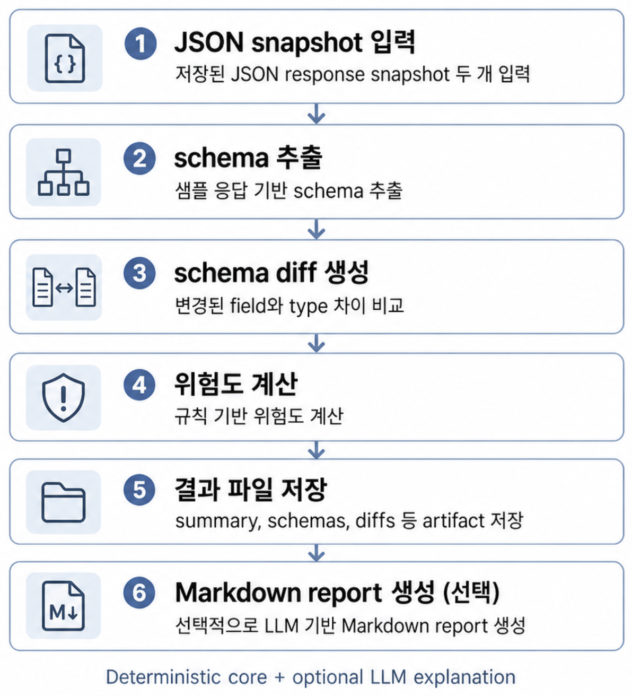

# DriftLens

## DriftLens 처리 흐름



## 한 줄 요약

**DriftLens**는 저장해 둔 두 개의 JSON 응답을 비교하여 field 추가, field 삭제, type 변경 같은 schema 변화를 찾아주는 **local-first CLI**이다.

목적은 parser, normalizer, table mapping, dashboard 같은 downstream 데이터 파이프라인이 깨질 수 있는 지점을 사전에 확인하는 것이다.

## 왜 필요한가

외부 API는 동일한 endpoint라도 상황에 따라 응답 구조가 달라질 수 있다.

field가 사라지거나, string이 number로 바뀌고, 혹은 object가 array로 변할 경우 수집은 성공해도 이후 처리 과정에서 문제가 생길 수 있다.

**DriftLens**는 저장된 JSON response snapshot끼리 비교하여 이러한 변화를 먼저 확인하기 위한 도구로 활용된다.

## 현재 할 수 있는 일

* 저장된 JSON response snapshot 두 개 입력
* 샘플 응답 기반 schema 추출
* schema diff 생성
* 규칙 기반 위험도 계산
* 결과 파일 저장
* 선택적으로 LLM 기반 Markdown report 생성

schema 추출, schema 비교, 규칙 기반 위험도 판정은 재현 가능한 코드가 담당한다.

LLM은 그 결과를 바탕으로 운영자 관점에서 이해하기 쉬운 설명을 생성하는 레이어이다.

## 코드 구조

* `driftlens/schema/`: JSON snapshot에서 관찰된 schema를 추출하고 schema diff를 계산한다.
* `driftlens/storage/`: 입력 snapshot과 생성 artifact를 파일 시스템에 저장한다.
* `driftlens/llm/`: deterministic diff 결과를 바탕으로 선택적 LLM analysis를 생성한다.
* `driftlens/reports/`: 계산된 결과와 LLM analysis를 Markdown report로 렌더링한다.
* `driftlens/detect.py`: previous/current JSON object를 받아 schema 추출, diff 생성, severity 계산, artifact 저장, optional report 생성을 orchestration한다.
* `driftlens/cli.py`: `driftlens detect` CLI entrypoint로 입력 파일 로딩, root validation, provider 설정 후 `run_detection()`을 호출한다.
* `tests/`: schema 추출, diff, severity, CLI artifact 생성 흐름을 검증한다.

## 사용 방법

**기본 환경:**

기본 deterministic CLI는 `llm` extra 없이 사용할 수 있다.

```bash
uv sync
```

**기본 실행:**

```bash
uv run driftlens detect previous.json current.json --out-dir .artifacts/demo
```

LLM API 없이 report 생성 흐름만 확인하려면 `mock` provider를 사용할 수 있다. `mock` provider는 `llm` extra가 필요하지 않다.

```bash
uv run driftlens detect previous.json current.json \
  --out-dir .artifacts/demo \
  --report \
  --analysis-provider mock
```

`openai-compatible` provider로 report를 생성하려면 먼저 optional dependency를 설치해야 한다.

```bash
uv sync --extra llm
```

그다음 아래 환경 변수가 필요하다.

* `LLM_API_KEY`
* `LLM_MODEL`
* `LLM_BASE_URL` (선택 사항)

```bash
uv run driftlens detect previous.json current.json \
  --out-dir .artifacts/demo \
  --report \
  --analysis-provider openai-compatible
```

`openai-compatible`은 OpenAI Chat Completions request/response shape와 호환되는 API를 뜻하며, 공식 OpenAI API로만 한정되지 않는다. 다만 현재 구현은 `openai` Python SDK를 사용하므로 호환 endpoint를 쓰더라도 `llm` extra가 필요하다.

`--report` 사용 시 `--analysis-provider` 옵션으로 원하는 provider를 선택한다.

## 생성되는 파일

**기본 실행 결과:**

* `summary.json`
* `samples/previous.json`
* `samples/current.json`
* `schemas/previous.json`
* `schemas/current.json`
* `diffs/schema_diff.json`
* `diffs/classified_diff.json`

**`--report` 사용 시 추가 생성 파일:**

* `llm/analysis.json`
* `reports/schema_drift.md`

## 예시

실제 Steam `appdetails` 응답 snapshot을 사용해 **DriftLens**를 시험해 본 예시이다.

공개 가능한 synthetic fixture와 mock report 생성 흐름은 [`docs/demo/sanitized-steam-appdetails.md`](docs/demo/sanitized-steam-appdetails.md)에 정리되어 있다.

Steam `appdetails` 응답은 실제 게임 데이터 바깥에 `appid` key가 붙어 있는 구조이다.

서로 다른 게임의 원본 응답 전체를 그대로 비교하면 `appid`가 다르다는 당연한 차이까지 diff에 포함될 수 있다.

하지만 그건 이 데모에서 보려는 schema 변화가 아니므로, 데모에서는 실제 게임 정보가 들어 있는 `response[appid]["data"]` 객체만 따로 저장해 `driftlens detect` 입력으로 사용하였다.

아래 결과는 특정 시점에 저장된 두 Steam response snapshot을 비교했을 때 관찰된 예시이다.

Steam 응답은 시점, region, request parameter에 따라 달라질 수 있으므로 항상 같은 결과가 나오는 것은 아니다.

**smoke test에서 관찰한 요약:**

* `change_count`: `59`
* `severity_counts`: `high 56`, `medium 0`, `low 3`
* 대표 변화 사항:
  * `linux_requirements`: `object` -> `array`
  * `price_overview` / `price_overview.currency`: 이전 snapshot에는 있었지만 현재 snapshot에서는 제거된 field로 관찰됨
  * `required_age`: type change 발생
  * `reviews`: added

또한 `price_overview` 없음, `data=[]`, `data=null`, `success=false`를 free/unavailable/delisted 의미로 자동 해석하지 않는다.

DriftLens는 Steam 상태를 자동 판정하는 도구가 아니라, 저장된 JSON snapshot 사이의 schema 차이를 보여주는 도구이다.

## LLM 분석에 대한 주의점

이번 smoke test에서는 실제 LLM report가 mock report보다 더 상세한 경로별 영향도(path-specific impact) 및 조치 사항(action item)을 포함하였다.

하지만 **LLM output은 source of truth가 아니다.**

Source of truth는 결정론적인 schema 추출, schema 비교, 규칙 기반 위험도 결과이다.

LLM은 이미 계산된 diff를 운영자가 읽기 쉬운 설명으로 바꾸는 레이어일 뿐이다.

## 입력 제약 및 주의사항

`driftlens detect` 입력으로는 root가 `object`인 JSON snapshot이 적합하다.

`data=[]`, `data=null`, `success=false` 같은 응답은 별도 precheck 대상으로 보는 것이 안전하다.

또한 현재 `driftlens detect`는 입력 JSON에서 어떤 부분을 비교할지 자동으로 선택하지 않는다.

따라서 사용자는 비교 목적에 맞는 JSON 객체를 snapshot으로 준비해야 한다.

예를 들어 Steam `appdetails` 응답처럼 실제 데이터 바깥에 `appid` wrapper가 붙어 있는 경우, `appid` 차이가 diff에 섞이는 것을 피하기 위해 원본 응답 전체가 아니라 `response[appid]["data"]` 객체만 따로 저장해 입력으로 사용하였다.

## 하지 않는 일

* Steam free/unavailable/delisted 같은 상태를 자동으로 판정하는 도구가 아님.
* API collector가 아님.
* scheduler/alerting system이 아님.
* 자동 코드 수정 도구가 아님.
